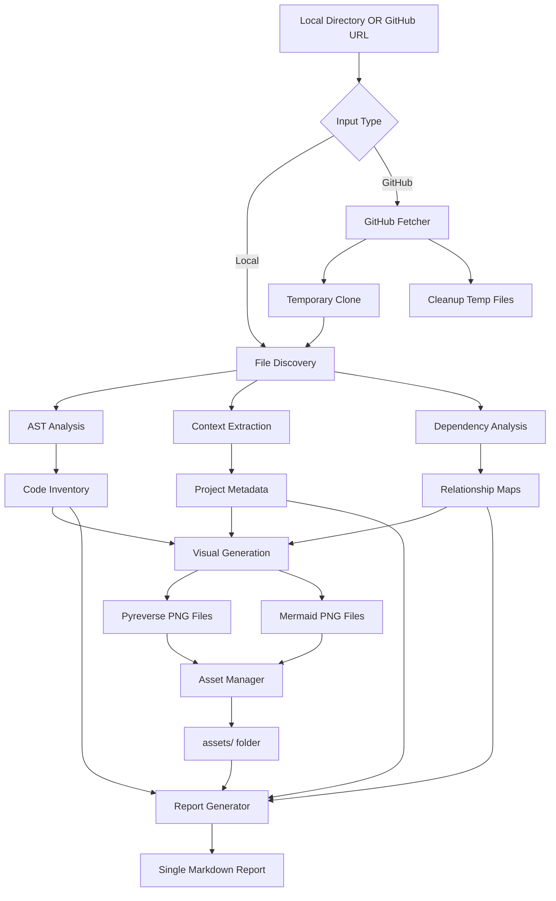

# Product Requirements Document (PRD): Python Project Quick Look Tool v2.0

**Document Version:** 1.0
**Date:** 2025-08-25
**Status:** Draft

---

## 🎯 Executive Summary

The Python Project Quick Look Tool v2.0 is a comprehensive static analysis tool that provides developers with an immediate, deep understanding of any Python project's structure, purpose, and architecture. Unlike simple code indexers, this tool combines AST-based analysis with visual diagrams, project context extraction, and rich reporting to answer the fundamental question: "What does this codebase do and how is it organized?"

## 🚀 Vision Statement

> "Enable any developer to understand the essence, structure, and architecture of an unfamiliar Python project within 5 minutes, without running any code."

---

## 📋 Product Goals

### Primary Goals

1. **Instant Project Comprehension**: Provide immediate understanding of project purpose and structure
2. **Visual Architecture Mapping**: Generate and integrate visual diagrams showing component relationships
3. **Comprehensive Code Inventory**: Catalog all classes, functions, methods with full documentation
4. **Safe Analysis**: Analyze projects without executing any code (pure static analysis)
5. **Rich Context Integration**: Extract project metadata from README, configs, and docstrings

### Secondary Goals

1. **Remote Repository Support**: Analyze GitHub repositories directly via URL
2. **Developer Workflow Integration**: Easy integration into documentation and onboarding processes
3. **Extensible Architecture**: Support for additional analysis plugins and output formats

---

## 🎯 Target Users

### Primary Users

- **Software Engineers** exploring unfamiliar codebases
- **Technical Leaders** conducting code reviews or architecture assessments
- **DevOps Engineers** understanding deployment requirements
- **Documentation Writers** creating technical documentation

### Use Cases

1. **Project Onboarding**: New team members understanding existing codebases
2. **Code Review Preparation**: Reviewers getting context before detailed review
3. **Architecture Documentation**: Generating up-to-date architectural overviews
4. **Dependency Analysis**: Understanding project structure and dependencies
5. **Legacy Code Assessment**: Analyzing inherited or unmaintained projects
6. **Remote Repository Analysis**: Quick analysis of GitHub projects without cloning

---

## 🔧 Functional Requirements

### Core Features

#### 1. Project Input & Context Analysis

- **REQ-001**: Support local directory analysis (existing functionality)
- **REQ-002**: Support GitHub URL analysis with pattern `github.com/username/reponame`
- **REQ-003**: Extract project purpose from README.md, setup.py, pyproject.toml
- **REQ-004**: Identify main entry points (CLI commands, main functions)
- **REQ-005**: Parse project metadata (dependencies, version, description)
- **REQ-006**: Extract usage examples and typical workflows

#### 2. Visual Architecture Integration & Asset Management

- **REQ-007**: Generate class diagrams using pyreverse/graphviz as PNG files
- **REQ-008**: Store all images in `assets/` folder alongside markdown report
- **REQ-009**: Embed visual diagrams in markdown using relative paths (``)
- **REQ-010**: Create module dependency graphs using mermaid.js (rendered as PNG)
- **REQ-011**: Generate data flow diagrams for main workflows

#### 3. Enhanced Code Analysis

- **REQ-012**: Extract complete docstrings without truncation
- **REQ-013**: Show all imports with dependency relationships
- **REQ-014**: Identify design patterns (Factory, Strategy, Abstract Base Classes)
- **REQ-015**: Analyze inheritance hierarchies and composition relationships
- **REQ-016**: Extract type hints, decorators, and async patterns

#### 4. Rich Markdown Report Generation

- **REQ-017**: Generate single comprehensive markdown file
- **REQ-018**: Include embedded images using relative paths to `assets/` folder
- **REQ-019**: Create interactive table of contents with anchor links
- **REQ-020**: Add syntax highlighting for code snippets
- **REQ-021**: Support collapsible sections for long content
- **REQ-022**: Generate clean, professional formatting with consistent styling

#### 5. Configuration & CLI Enhancement

- **REQ-023**: Parse argparse definitions for CLI usage patterns
- **REQ-024**: Extract configuration file schemas
- **REQ-025**: Show environment variable requirements
- **REQ-026**: Generate installation and setup instructions

### Advanced Features

#### 6. Remote Repository Support

- **REQ-027**: Accept GitHub URLs with pattern `github.com/username/reponame`
- **REQ-028**: Temporary clone GitHub repositories for analysis
- **REQ-029**: Clean up temporary directories after analysis
- **REQ-030**: Handle private repositories with authentication
- **REQ-031**: Support branch specification (default to main/master)

#### 7. Analysis Depth Control

- **REQ-032**: Configurable analysis depth (quick vs comprehensive)
- **REQ-033**: Filter by documentation coverage (show only documented items)
- **REQ-034**: Focus modes (classes-only, functions-only, architecture-only)
- **REQ-035**: Custom ignore patterns and inclusion rules

---

## 🏗️ Technical Architecture

### System Components

#### 1. Core Analysis Engine (`python_quicklook.py`)

- AST-based static analysis
- File discovery and filtering
- Symbol extraction and metadata collection
- Safe analysis without code execution

#### 2. Input Handlers (new modules)

- **`github_fetcher.py`**: GitHub repository cloning and cleanup
- **`project_context.py`**: README, setup.py, pyproject.toml parsing
- **`cli_analyzer.py`**: argparse and command-line interface analysis
- **`dependency_analyzer.py`**: Import relationships and dependency graphs

#### 3. Visual Generators (new modules)

- **`diagram_generator.py`**: pyreverse integration and PNG generation
- **`mermaid_generator.py`**: mermaid.js diagram creation and PNG rendering
- **`asset_manager.py`**: `assets/` folder management and relative path handling

#### 4. Enhanced Report Generator (`report_generator.py` v2)

- Single markdown file output with embedded images
- Collapsible sections and interactive elements
- Relative path image embedding (``)
- Clean, professional formatting

#### 5. File Structure

- **Output**: Single `report.md` file + `assets/` folder
- **`assets/`**: All generated PNG diagrams and images
- **Temporary**: GitHub repositories (auto-cleaned after analysis)

### Data Flow Architecture

---

## 🛠️ Implementation Plan

### Phase 1: Enhanced Context & Visual Integration (Week 1)

**Duration: 5-7 days**

#### Sprint 1.1: Project Context Analysis (2 days)

1. **Day 1**: Create `project_context.py`
   - Parse README.md for project description and usage
   - Extract metadata from pyproject.toml/setup.py
   - Identify main entry points and CLI commands
   - **Test**: Verify context extraction on sample projects

2. **Day 2**: Integrate context into reports
   - Add project overview section to report generator
   - Show dependencies, setup requirements, and usage
   - **Test**: Generate enhanced reports with context

#### Sprint 1.2: Visual Diagram Integration (2 days)

1. **Day 3**: Create `diagram_generator.py`
   - Integrate pyreverse for class diagrams
   - Generate PNG/SVG diagrams programmatically
   - Handle graphviz dependencies and fallbacks
   - **Test**: Generate diagrams for various project types

2. **Day 4**: Embed diagrams in reports
   - Create `visual_embedder.py` for asset management
   - Embed images directly in markdown
   - Add diagram captions and descriptions
   - **Test**: Full reports with embedded diagrams

#### Sprint 1.3: Enhanced Analysis (1 day)

1. **Day 5**: Remove truncation and enhance extraction
   - Show complete docstrings without "..." truncation
   - Extract all imports without "... and X more"
   - Improve signature extraction and formatting
   - **Test**: Verify complete information extraction

### Phase 2: Rich Interactive Content (Week 2)

**Duration: 5-7 days**

#### Sprint 2.1: Dependency Analysis (2 days)

1. **Day 6**: Create `dependency_analyzer.py`
   - Build import dependency graphs
   - Identify circular dependencies
   - Map module relationships
   - **Test**: Generate dependency maps for complex projects

2. **Day 7**: Create `mermaid_generator.py`
   - Generate mermaid.js diagrams for workflows
   - Create module dependency graphs
   - Add data flow visualizations
   - **Test**: Verify mermaid diagram generation

#### Sprint 2.2: CLI and Configuration Analysis (2 days)

1. **Day 8**: Create `cli_analyzer.py`
   - Parse argparse configurations
   - Extract CLI usage patterns and commands
   - Generate usage examples
   - **Test**: Extract CLI patterns from various projects

2. **Day 9**: Enhanced configuration analysis
   - Parse configuration file schemas
   - Extract environment variable requirements
   - Generate setup and installation instructions
   - **Test**: Complete configuration analysis

#### Sprint 2.3: Rich Report Generation (1 day)

1. **Day 10**: Enhance `report_generator.py`
   - Add collapsible sections for long content
   - Improve navigation and formatting
   - Add emoji and visual indicators
   - **Test**: Generate rich, navigable reports

### Phase 3: Remote Repository Support & Polish (Week 3)

**Duration: 3-5 days**

#### Sprint 3.1: GitHub Repository Support (2 days)

1. **Day 11**: GitHub URL parsing and fetching
   - Create `github_fetcher.py` with URL validation
   - Implement temporary repository cloning
   - Add cleanup mechanisms for temp directories
   - **Test**: Clone and analyze various GitHub repos

2. **Day 12**: Integration and error handling
   - Integrate GitHub fetching into main workflow
   - Handle authentication for private repos
   - Add branch specification support
   - **Test**: End-to-end GitHub URL analysis

#### Sprint 3.2: Testing & Documentation (2 days)

1. **Day 13**: Comprehensive testing
   - Unit tests for all components
   - Integration tests with sample projects
   - Performance testing on large codebases
   - **Test**: Full test suite execution

2. **Day 14**: Documentation and examples
   - Complete README with usage examples
   - Sample reports for different project types
   - Installation and setup guide
   - **Test**: End-to-end user experience

#### Sprint 3.3: Performance & Polish (1 day)

1. **Day 15**: Performance optimization and final polish
   - Caching for repeated analysis
   - Progress indicators for large projects
   - Error handling and user feedback
   - **Test**: Performance on various project sizes

---

## 🧪 Testing Strategy

### Test Categories

#### 1. Unit Tests

- **Component Testing**: Each module tested in isolation
- **AST Parsing**: Verify correct extraction from various Python constructs
- **Context Extraction**: Test README, config file parsing
- **Diagram Generation**: Mock pyreverse and verify output

#### 2. Integration Tests

- **End-to-End Workflows**: Complete analysis pipeline testing
- **Multi-format Output**: Verify all export formats work correctly
- **Asset Management**: Test image generation and embedding
- **Error Handling**: Invalid projects, missing dependencies

#### 3. Performance Tests

- **Large Projects**: Test on projects with 100+ modules
- **Memory Usage**: Monitor memory consumption during analysis
- **Generation Speed**: Benchmark report generation times
- **Scalability**: Test with various project sizes

#### 4. User Acceptance Tests

- **Real-world Projects**: Test on popular open-source projects
- **Usability**: Can new users understand generated reports?
- **Accuracy**: Do reports correctly represent project structure?
- **Completeness**: Are all important aspects covered?

### Test Projects Portfolio

1. **Simple Project**: Single module, basic functions
2. **Medium Project**: Multiple modules, classes, inheritance
3. **Complex Project**: Large codebase with async, decorators, metaclasses
4. **CLI Project**: Rich argparse configuration
5. **Library Project**: Abstract base classes, design patterns
6. **This Project**: Self-analysis for validation

---

## 📊 Success Metrics

### Quantitative Metrics

- **Analysis Speed**: < 30 seconds for local projects with 50+ modules
- **GitHub Clone Speed**: < 60 seconds for remote repository analysis
- **Report Generation**: < 10 seconds for markdown + assets output
- **Accuracy**: 95%+ of classes/functions correctly identified
- **Visual Quality**: All generated PNG diagrams render correctly in markdown
- **Coverage**: 90%+ of project context successfully extracted

### Qualitative Metrics

- **Comprehensibility**: Can unfamiliar developers understand project within 5 minutes?
- **Completeness**: Does report answer "what does this do?" and "how is it structured?"
- **Visual Appeal**: Are reports professional with embedded diagrams?
- **Portability**: Can markdown + assets folder be easily shared and viewed?

---

## 🚨 Risks & Mitigation

### Technical Risks

1. **Pyreverse/Graphviz Dependencies**
   - *Risk*: Complex installation requirements
   - *Mitigation*: Fallback to text-based diagrams, clear installation docs

2. **Large Project Performance**
   - *Risk*: Slow analysis on very large codebases
   - *Mitigation*: Incremental analysis, caching, progress indicators

3. **Python Version Compatibility**
   - *Risk*: AST parsing fails on different Python versions
   - *Mitigation*: Test on multiple Python versions, graceful degradation

### User Experience Risks

1. **Information Overload**
   - *Risk*: Reports too detailed for quick understanding
   - *Mitigation*: Executive summary, collapsible sections, focus modes

2. **Installation Complexity**
   - *Risk*: Tool difficult to install and use
   - *Mitigation*: Simple pip installation, clear documentation

---

## 📦 Deliverables

### Code Deliverables

1. **Enhanced Python Quick Look Tool v2.0**
   - Complete source code with GitHub URL support
   - Comprehensive test suite
   - Performance benchmarks

2. **Documentation Package**
   - Updated README with local and GitHub URL examples
   - Installation and usage guide
   - Sample reports with embedded PNG diagrams
   - Asset folder structure documentation

3. **Output Structure**
   - Single markdown report template
   - Assets folder with PNG diagrams
   - Relative path embedding examples

### Report Deliverables

1. **Enhanced Analysis Report** (this project)
   - Single markdown file with embedded PNG diagrams
   - Complete assets/ folder with all visual diagrams
   - Demonstrate all v2.0 features including GitHub URL support

2. **Sample Analysis Reports**
   - Local repository analysis example
   - GitHub URL analysis example (e.g., `github.com/octocat/Hello-World`)
   - Performance benchmarks and validation

---

## 🔄 Future Roadmap (Post-v2.0)

### Version 2.1: Advanced Analytics

- Code quality metrics integration
- Test coverage analysis
- Security vulnerability scanning
- Performance bottleneck identification

### Version 2.2: Enhanced Repository Support

- GitLab and Bitbucket URL support
- Multiple branch analysis and comparison
- Private repository authentication improvements
- Archive/zip file analysis support

### Version 3.0: Multi-language Support

- JavaScript/TypeScript analysis
- Java project support
- Go language analysis
- Polyglot project handling

---

**Document Prepared By**: Claude Code Assistant
**Review Required**: Product Owner, Technical Lead
**Next Review Date**: Upon Phase 1 completion
